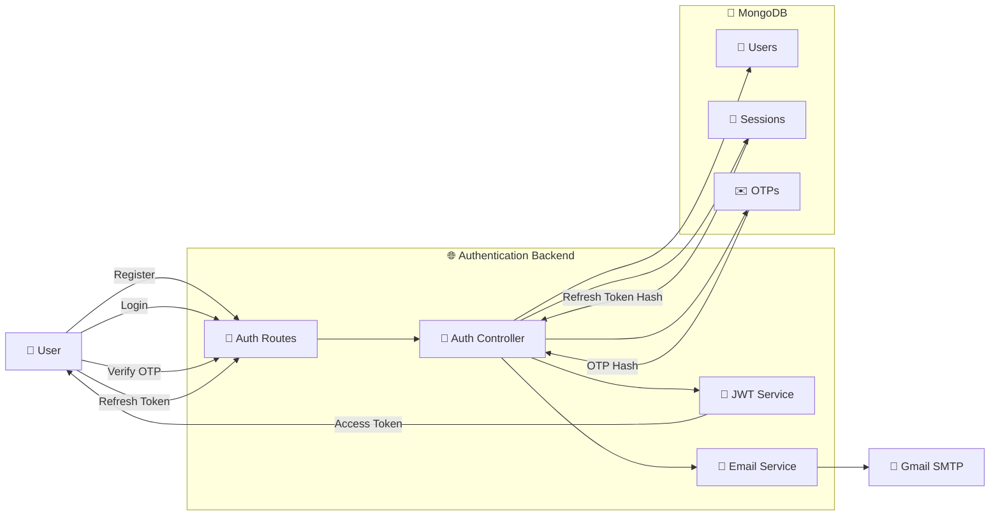

```mermaid
flowchart LR

    U["👤 User"]

    subgraph Backend["🌐 Authentication Backend"]
        R["📍 Auth Routes"]
        C["🔐 Auth Controller"]
        J["🎫 JWT Service"]
        E["📧 Email Service"]
    end

    subgraph Database["🍃 MongoDB"]
        US["👤 Users"]
        SE["🔑 Sessions"]
        OT["✉️ OTPs"]
    end

    G["📨 Gmail SMTP"]

    U -->|"Register"| R
    U -->|"Login"| R
    U -->|"Verify OTP"| R
    U -->|"Refresh Token"| R

    R --> C

    C --> J

    C --> US
    C --> SE
    C --> OT

    C --> E
    E --> G

    J -->|"Access Token"| U
    SE -->|"Refresh Token Hash"| C
    OT -->|"OTP Hash"| C
```
