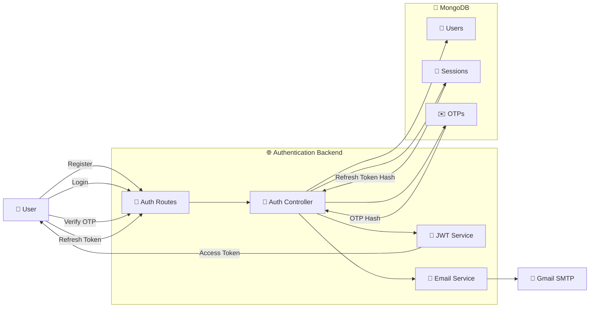

# 🔐 Authentication Service

A secure authentication backend built with Node.js, Express, MongoDB, JWT, Refresh Token Rotation, and Email OTP Verification.

This project demonstrates production-oriented authentication concepts such as session management, refresh token rotation, secure cookies, email verification, and multi-device logout.

---

## ✨ Features

### Authentication

- User Registration
- User Login
- JWT Access Tokens
- Refresh Tokens
- Secure HttpOnly Cookies

### Email Verification

- OTP Generation
- OTP Hashing
- Email Delivery using Gmail SMTP
- Account Verification

### Session Management

- Session Tracking
- Refresh Token Hashing
- Refresh Token Rotation
- Logout Current Device
- Logout All Devices

### Security Features

- Password Hashing
- JWT Authentication
- Refresh Token Rotation
- Secure Cookie Storage
- OTP Hash Storage

---

## 🏗️ System Architecture


## 🔄 Authentication Flow

### User Registration

1. User submits registration form
2. Password is hashed
3. User document is created
4. OTP is generated
5. OTP hash is stored
6. OTP is sent via email
7. User account remains unverified until OTP verification

---

### Email Verification

1. User submits OTP
2. OTP hash is compared
3. User account becomes verified
4. OTP record is deleted

---

### Login

1. User submits credentials
2. Password is verified
3. Access Token is generated
4. Refresh Token is generated
5. Session is created
6. Refresh Token is stored in HttpOnly Cookie

---

### Refresh Token Rotation

1. User sends Refresh Token
2. Session is validated
3. New Access Token generated
4. New Refresh Token generated
5. Old Refresh Token invalidated
6. Session updated

---

### Logout

1. Session is marked revoked
2. Refresh Cookie is removed

---

### Logout All Devices

1. All sessions belonging to the user are found
2. All sessions are revoked
3. User is logged out from every device

---

## 📂 Project Structure

```text
src/
├── config/
│   ├── config.js
│   └── databse.js
│
├── controllers/
│   └── auth.controller.js
│
├── models/
│   ├── user.model.js
│   ├── session.model.js
│   └── otp.model.js
│
├── routes/
│   └── auth.routes.js
│
├── services/
│   └── email.service.js
│
├── utils/
│   └── utils.js
│
├── app.js
│
server.js
```

---

## 📌 API Endpoints

| Method | Endpoint | Description |
|----------|----------|----------|
| POST | /register | Register User |
| POST | /login | Login User |
| POST | /verify-email | Verify OTP |
| GET | /get-me | Current User |
| GET | /refresh-token | Generate New Tokens |
| GET | /logout | Logout Current Device |
| GET | /logout-all | Logout All Devices |

---

## 🛠️ Tech Stack

### Backend

- Node.js
- Express.js

### Database

- MongoDB
- Mongoose

### Authentication

- JWT
- Refresh Token Rotation

### Email

- Nodemailer
- Gmail SMTP

---
